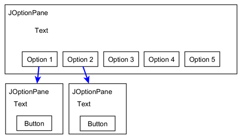

# Smart Currency Sorting Application

## Brief
Develop a coin sorting program, using Pound sterling (£) as the default currency. Note: 1 pound is equal to 100 pennies e.g. £1 = 100p.
The following coins (in order of priority) are in circulation in the scope of this program:
•	£2 (equivalent to 200p)
•	£1 (equivalent to 100p)
•	50p
•	20p
•	10p
The minimum input value for exchange in pennies is 0 (inclusive). The maximum input value for exchange in pennies is capped at 10,000 (inclusive).
The program should enable the user to check, at most, how many coins of a certain denomination can be exchanged given an input value in pennies and the denomination. It should also print the remainder. For example, given the input value of 352 pennies and the input denomination of £1 coins, the output should be three £1 coins and a remainder of 52p.
Given a total value in pennies and a coin denomination to exclude, the program should also allow the user to determine how many coins and what denominations (prioritising the higher denominations) they can exchange for while excluding a certain coin denomination. The remainder should also be printed. For example, given 563 pennies and excluding the £2 coin, we can exchange for five £1 coins, one 50p coin and one 10p coin, with a remainder of 3p.
The program should also have several utility functions; all user input should be validated to ensure the robustness of user input/output. The user should also be able to print the current configurations of the program (current currency, min/max coin to exchange).

## Task

### Part A – Coin Sorter
#### 1.	Implementation: 
Create a new class called CoinSorter using the class diagram below:

CoinSorter
-currency : String
-minCoinIn: int
-maxCoinIn : int
-coinList : List<Integer>
+CoinSorter(String, int, int, List< Integer >)
+CoinSorter()
+setCurrency(String)
+setMinCoinIn(int)
+setMaxCoinIn(int)
+getCurrency(): String
+getMinCoinIn (): int
+getMaxCoinIn (): int
+printCoinList(): String
+coinCalculator(int, int) : String
+multiCoinCalculator(int, int) : String
+displayProgramConfigs() : String

CoinSorter(String, int, int, List<Integer>) 
•	The constructor should initialise the following properties: currency, minimum value to exchange, maximum value to exchange and the initial list of coin denominations. These properties should follow the information defined at the start of the brief.
 
CoinSorter() 
setCurrency(String) 
setMinCoinIn(int) 
setMaxCoinIn(int) 
•	These “set” methods should set the corresponding attributes.
getCurrency() : String
getMinCoinIn() : int
getMaxCoinIn() : int
•	These “get” methods should return the corresponding attribute values. 
printCoinList() : String
•	This method should print the contents of the coin list, indicating what denominations are currently in circulation. An example output is as follows: “The current coin denominations are in circulation: 200, 100, 50, 30, 10”.
coinCalculator(int, int) : String
•	This method should take two values; the total value to exchange and a coin type, in order to calculate and return the maximum number of coins of the input coin type that can be exchanged, in addition to the remainder as a string. For example, coinCalculator(562, 50) may return “A total of 11 x 50p coins can be exchanged, with a remainder of 12p”.
multiCoinCalculator(int, int) : String
•	This method should take two values; the total value to exchange and a coin type to exclude, in order to calculate and return the maximum number of coins of the input coin type that can be exchanged while excluding the input coin type, in addition to the remainder as a string. For example, multiCoinCalculator(562, 50) may return “The coins exchanged are: 2 x 200p, 1 x 100p, 0 x 50p, 3 x 20p, 0 x 10p, with a remainder of 2p”.
DisplayProgramConfigs() : String
•	This method should return the following as a string: the current currency and the current minimum and maximum value accepted as input.
 
#### 2.	Textual Menu: 
Create a test class called testCoinSorter. Create a main method, which should create and initialise a CoinSorter object. You should set the default details within the code, following the specifications in the brief. After initialising a CoinSorter object, the user should be presented with the following menu:

***Coin Sorter - Main Menu***
1 - Coin calculator
2 - Multiple coin calculator
3 - Print coin list
4 - Set details
5 - Display program configurations
6 - Quit the program
These menu choices should be repeated until the user quits. Option 1 and 2 should prompt the user to enter some values, where the input values should be validated before being passed to the relevant methods in order to generate some results.
When Option 4 is chosen, the user should be presented with the following sub-menu allowing them to interactively set the following details for the program:
***Set Details Sub-Menu***
1 - Set currency
2 - Set minimum coin input value
3 - Set maximum coin input value
4 - Return to main menu
These menu choices should be repeated until the user chooses Option 4 in the Sub-Menu and returns to the main menu. Again, all user input values should be validated.

#### 3.	Functionality/Testing: 
Show evidence that ALL the methods in the CoinSorter class and the options in the textual-menu have been individually tested and that the testCoinSorter class can be compiled and run from the command line.
Hint: You should ensure that all user input values are validated. You should also investigate boundary testing. 

### Part B – Graphical Menu

#### 1.	Graphical Menu: 
Create the following two classes: CoinSorterGUI and a test class testCoinSorterGUI. The user should be presented with a graphical menu based on the structure of the textual menu created in Part A.2. You should make any changes necessary to the CoinSorterGUI class in order to meet the requirements of Part B.

 
    Figure 1: Example GUI menu design.
    
Figure 1 shows an example of a graphical menu (this is provided as an illustration only; you are not required to follow this design). You can use either Java Swing (JOptionPane) or JavaFX. The technology choice has no impact on the marking process; you should ensure that the GUI components are:
•	Appropriately selected for the intended purpose e.g. you shouldn’t use checkboxes for menu options. 
•	You should investigate and implement a range of GUI components e.g. the GUI shouldn’t only consist of a single textbox duplicated across all options.
•	All information and options are clearly indicated in the design e.g. the user can intuitively understand what, where and how information should be input/output.

#### 2.	Functionality/Testing: 
Show evidence that ALL the methods in the CoinSorterGUI class and the options in the GUI menu are individually tested and that the testCoinSorterGUI class can be compiled and run from the command line.

Hint: You should ensure that all user input values are validated. You should also investigate boundary testing.
